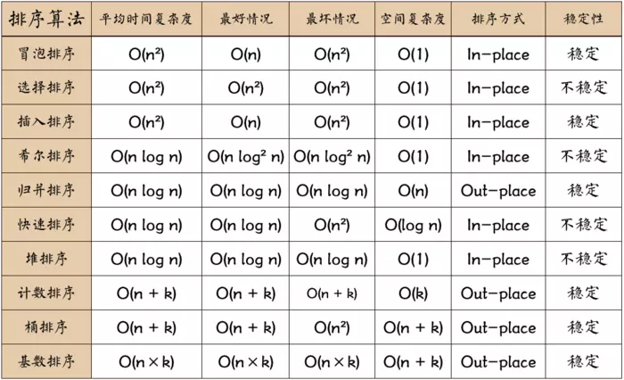

## 数组去重
```javascript
let originalArray = [1,2,3,4,5,3,2,4,1];

// 方式1
const result = Array.from(new Set(originalArray))
consr result = [...new Set(originalArray)]
console.log(result) // -> [1, 2, 3, 4, 5]

// 方式2
const result = []
const map = new Map()
for (let v of originalArray) {
    if (!map.has(v)) {
        map.set(v, true)
        result.push(v)
    }
}
console.log(result) // -> [1, 2, 3, 4, 5]

// 方式3
const result = []
for (let v of originalArray) {
    if (!result.includes(v)) {
        result.push(v)
    }
}
console.log(result) // -> [1, 2, 3, 4, 5]

// 方式4
for (let i = 0; i < originalArray.length; i++) {
    for (let j = i + 1; j < originalArray.length; j++) {
        if (originalArray[i] === originalArray[j]) {
            originalArray.splice(j, 1)
            j--
        }
    }
}
console.log(originalArray) // -> [1, 2, 3, 4, 5]

// 方式5
const obj = {}
const result = originalArray.filter(item => obj.hasOwnProperty(typeof item + item) ? false : (obj[typeof item + item] = true))
console.log(result) // -> [1, 2, 3, 4, 5]
```
--------

## 排序实现


### 部分算法实现

```javascript
/**
 * 冒泡排序
 * 思路：遍历数组，如当前数大于/小于后一位，则交换，一轮遍历出一个最大/最小值,直到结束
 * @param {Array} arr 
 */
function bubble (arr) {
  if (!arr.length || arr.length === 1) return arr
  for(let i = 1; i < arr.length; i++) {
    let flag = true //优化判断，没有交换跳出循环
    for (let j = 0; j < arr.length - i; j++) {
      if (arr[j] > arr[j + 1]) {
        flag = false
        [arr[j], arr[j + 1]] = [arr[j + 1], arr[j]]
      }
    }
    if (flag) break
  }
  return arr
}

/**
 * 快速排序
 * 思路：分治法，选定一个基点，拆分为两个数组，小于在左，大于在右，递归直到无法继续拆分
 * @param {Array} arr
 * @returns {Array}
 */
function quickSort (arr) {
  if (arr.length <= 1) return arr
  let point = arr.splice([Math.ceil(arr.length / 2)], 1)[0]
  let left = [], right = []
  arr.forEach(item => {
    item > point ? right.push(item) : left.push(item)
  })
  return quickSort(left).concat(point, quickSort(right))
}

/**
 * 选择排序
 * 思路：大概思路是找到最小的放在第一位，找到第二小的放在第二位，以此类推 算法复杂度O(n^2)
 * @param {Array} arr
 * @returns {Array}
 */
function selectionSort(arr) {
	let len = arr.length;
	let minIndex;
	for (let i = 0; i < len - 1; i++) {
		minIndex = i;
		for (let j = i + 1; j < len; j++) {
			if (arr[j] < arr[minIndex]) {     //寻找最小的数
			    minIndex = j;                 //将最小数的索引保存
		    }
		}
		[arr[i], arr[minIndex]] = [arr[minIndex], arr[i]];
	}
return arr;
}

/**
 * 选择排序
 * 思路：每次排一个数组项，假设数组的第一项已经排序，接着，把第二项与第一项进行对比，第二项是该插入到第一项之前还是之后，第三项是该插入到第一项之前还是第一项之后还是第三项
 * @param {Array} arr
 * @returns {Array}
 */
function insertionSort(arr) {
	let len = arr.length;
	let preIndex, current;
	for (let i = 1; i < len; i++) {
	    preIndex = i - 1;
	    current = arr[i];
	    while (preIndex >= 0 && arr[preIndex] > current) {
		    arr[preIndex + 1] = arr[preIndex];
		    preIndex--;
	    }
	    arr[preIndex + 1] = current;
	}
	return arr;
}

/**
 * 归并排序
 * 思路：使用归并排序作为Array.prototype.sort的实现，而chrome使用快速排序的一个变体实现的,前面三种算法性能不好，但归并排序性能不错 算法复杂度O(nlog^n)
 * 说明： 归并排序是一种分治算法。本质上就是把一个原始数组切分成较小的数组，直到每个小数组只有一个位置，接着把小数组归并成较大的数组，在归并过程中也会完成排序，直到最后只有一个排序完毕的大数组
 * @param {Array} arr
 * @returns {Array}
 */
function mergeSort(arr) {  //采用自上而下的递归方法
    let len = arr.length;
    if(len < 2) {
        return arr;
    }
    let middle = Math.floor(len / 2),
    left = arr.slice(0, middle),
    right = arr.slice(middle);
    return merge(mergeSort(left), mergeSort(right));
}

function merge(left, right){
    let result = [];
    while (left.length && right.length) {
        if (left[0] <= right[0]) {
            result.push(left.shift());
        } else {
            result.push(right.shift());
        }
    }
    result.push(...left);
    result.push(...right);
    return result;
}

/**
 * 堆排序
 * 思路：堆排序把数组当中二叉树来排序而得名。
// 1）索引0是树的根节点；2）除根节点为，任意节点N的父节点是N/2；3）节点L的左子节点是2*L；4）节点R的右子节点为2*R + 1
// 本质上就是先构建二叉树，然后把根节点与最后一个进行交换，然后对剩下对元素进行二叉树构建，进行交换，直到剩下最后一个
 * @param {Array} arr
 * @returns {Array}
 */
var len;    //因为声明的多个函数都需要数据长度，所以把len设置成为全局变量
function buildMaxHeap(arr) {   //建立大顶堆
    len = arr.length;
    for (let i = Math.floor(len / 2); i >= 0; i--) {
        heapify(arr, i);
    }
}
function heapify(arr, i) {     //堆调整
    let left = 2 * i + 1;
    let right = 2 * i + 2;
    let largest = i;
    if (left < len && arr[left] > arr[largest]) {
        largest = left;
    }
    if (right < len && arr[right] > arr[largest]) {
        largest = right;
    }
    if (largest !== i) {
        [arr[i], arr[largest]] = [arr[largest], arr[i]];
        heapify(arr, largest);
    }
}
function heapSort(arr) {
    buildMaxHeap(arr);
    for (let i = arr.length - 1; i > 0; i--) {
        [arr[0],arr[i]]=[arr[i],arr[0]];
        len--;
        heapify(arr, 0);
    }
    return arr;
}
```

## 旋转数组
```javascript
/**
 * 给定一个数组，将数组中的元素向右移动 k 个位置，其中 k 是非负数
 * @param {Array} arr
 * @param {Number} index
 * @returns {Array}
 */
function rotate (arr, k) {
    let time = k
    if (arr.length <= 1) return arr
    for(let i = 0; i < time; i++) {
        arr.unshift(arr.splice(arr.length - 1)[0])
    }
    return arr
}
```

## 给定一个数组 nums，编写一个函数将所有 0 移动到数组的末尾，同时保持非 零元素的相对顺序
```javascript
/**
 * 示例: 输入: [0,1,0,3,12] 输出: [1,3,12,0,0] 复制代码说明: 必须在原数组上操作，不能拷贝额外的数组。 尽量减少操作次数
 * @param {Array} arr
 * @returns {Array}
 */
function moveZero (arr) {
    for(let i = 0, j = 0;i < arr.length - j; i++) {
        if (arr[i] === 0){
            arr.splice(i,1)
            arr.push(0)
            i--
            j++
        }
    }
    return arr
}
```
function add (a) {
    function s(b) {
        a = a + b
        return s
    }
    s.toString = function () {
        return a
    }
    return s
}

function curry (fn, ...args) {
    args.length > fn.length ? fn(...args) : (...more) => curry(fn, ...args, ...more)
}

## 给定一个整数数组和一个目标值，找出数组中和为目标值的两个数。 你可以假设每个输入只对应一种答案，且同样的元素不能被重复利用。
```javascript
/**
 * 示例： 给定 nums = [2, 7, 11, 15], target = 9 因为 nums[0] + nums[1] = 2 + 7 = 9 所以返 回 [0, 1]
 * @param {Array} arr
 * @param {Number} target
 * @returns {Array}
 */
function twoNumbers (arr, target) {
    let res = []
    for(let i = 0; i < arr.length;i++) {
        for(let j = 0; j < arr.length;j++) {
            if (arr[i] + arr[j] === target) {
                res = [arr[i], arr[j]]
                return res
            }
        }
    }
    return res
}
```

## 数组转树
```javascript
let list =[ 
    {id:1,name:'部门 A',parentId:0}, 
    {id:2,name:'部门 B',parentId:0}, 
    {id:3,name:'部门 C',parentId:1}, 
    {id:4,name:'部门 D',parentId:1}, 
    {id:5,name:'部门 E',parentId:2}, 
    {id:6,name:'部门 F',parentId:3}, 
    {id:7,name:'部门 G',parentId:2}, 
    {id:8,name:'部门 H',parentId:4}
    ];
function convert(list) {
    let obj = {}, res = []
    list.forEach(item => {
        obj[item['id']] = item
    })
    list.forEach(item => {
        let target = obj[item.parentId]
        if (target) {
            (target.child || (target.child = [])).push(item)
        } else {
            res.push(item)
        }
    })
    return res
}
```

## 树转数组
```javascript
function convertRe(tree) {
    const list = getItem(tree)
    function getItem (tree) {
        let arr = []
        tree.forEach(item => {
            arr.push(item)
            if (item.child) {
                arr = arr.concat(getItem(item.child))
            }
        })
        return arr
    }
    list.forEach(item => {
        delete item.child
    })
    return list
}
    
```

## 寻找中位数
```javascript
/**
 * 给定两个大小为 m 和 n 的有序数组 nums1 和 nums2。请找出这两个有序数组的中位数。要求算法的时间复杂 度为 O(log(m+n))。
 * @param {Array} m
 * @param {Array} n
 * @returns {Number}
 */
function findMid (m, n) {
    let i = 0, j = 0
    let res = []
    let midNum = Math.ceil((m.length + n.length) / 2) + 1
    let iseven = (m.length + n.length) % 2 === 0
    for(let k = 0;k < midNum;k++) {
        if(i < m.length && j <n.length) {
            if (m[i] < n[j]) {
                res.push(m[i])
                i++
            } else {
                res.push(n[j])
                j++
            }
        } else if (i < m.length) {
            res.push(m[i])
                i++
        } else {
            res.push(n[j])
                j++
        }
    }
    return iseven ? (res[res.length] + res[res.length - 1]) /2 : res[res.length - 1]
}
```
## 返回数组翻转字符串
```javascript
/**
 * 写一个函数，输入 int 型，返回整数逆序后的字符串。如：输入 整型 1234，返回字符串“4321”。要求必须使用递归函数调用，不能用全局变量， 输入函数必须只有一个参数传入，必须返回字符串。
 * @param {Number} m
 * @returns {String}
 */
// 数字过大会出现异常
function reserve (m) {
    let str = ''
    if (m < 10) return str + m
    let num1 = parseInt(m / 10)
    let num2 = m % 10
    return str + num2 + reserve(num1)
}
```


<!-- 闭包
动态路由
react domdiff
react组件通信方法
react hooks
react性能优化
前端监控
服务端渲染ssr -->