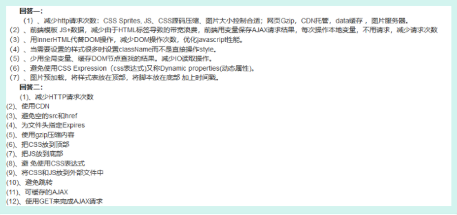

## HTML&&CSS类
1. 介绍一下盒子模型
   > 如何改变盒子模型类型

   - 标准模式：width与height指的是内容区域的宽高，增加padding、border、margin会影响总体尺寸
   - 怪异模式：width与height指内容区+padding+border，增加padding、border不会影响总体尺寸
2. 弹性布局介绍一下（原理，常见用法）
3. 动画有了解吗
4. 什么是重绘，什么是回流
    > 哪个开销大？
5. 说说对h5存储/缓存的认识
   > Cookie、Session Storage、Local Storage差异
6. H5的WebSocket有了解吗
    - 用于建立长连接
    - 与ajax的区别
    - 心跳重连机制
7. 如何画一条0.5px直线
    - scale缩放
8. 如何清除浮动
    > 伪类有了解吗
------
## JS类
1. 说下你知道的数组/对象遍历方法，以及他们区别优缺点
2. ==和===的区别， null和undefined的区别
3. 介绍一下冒泡事件和捕获事件（相似问题：10000个按钮怎么绑定事件）
    > 实际应用举例   
    >如何阻止冒泡时间，原生方法/vue方法
4. 说说es6+的新特性
    - 基础数据类型symbol、bigint
    - let/const 块级作用域
    - 箭头函数: 简易写法，箭头函数本身没有自己的this，this指向定义时所在的对象，而不是使用时所在对象
    - 解构赋值
    - 模板字符串
    - ...扩展运算符（用法：复制、展开数组、合并数组）
    - Array.from（将类数组转换为数组）
    - Set()和Map()数据结构（set没有重复值，map类似于对象，但‘’键‘’允许是各种数据类型，包括对象）
    - proxy（vue3双向绑定实现原理）
    - promise对象
    - generator函数（yield为一个步骤，不会立即执行，next（）一次执行一个步骤，再次next下一个步骤）
    - async...await（代替promise异步写法，可理解为是generator的语法糖，async=*，await=yield)
    - Class类的概念
      ```javascript
      class A(){
        constructor(params) {
          this.params = params
        }
        aa () {
          return 'aa'
        }
      }
      Class B extends A {
        constructor(name) {
          this.name = name
          super()
        }
      }
      ```
    > 说说es6的import和require导入的区别
      - import是在编译时加载，require在调用时加载，import效率更高
require支持动态解析
      - commonJS（require）是输出值的复制，es6（import）是值的引用
5. 说说JS的循环加载机制（Event Loop）
   > 哪些属于宏任务、哪些属于微任务
6.  JS判断类型的方法及区别
    - typeof：判断基本类型，无法判断null
       > js 在底层存储变量的时候，会在变量的机器码的低位1-3位存储其类型信息(000：对象,010：浮点数,100：字符串,110：布尔,1：整数),null是0,因此也会被判断为object。同时object不会判断具体是哪种object，要用instanceof
    - instanceof：检测A的对象原型是否在B上，返回Boolean
    - constructor： A.constructor === 'type'
    - Object.prototype.toString.call(A): 最全面的方法，可以判断所有类型
7. 遍历数组和遍历对象的方法
    - 数组：forEach、for循环、for in、 for of、（map、filter、some、every、reduce）
    - 对象：for in、Object.keys()，object.getOwnPropertyNames()
    > for in 和 for of 的区别
    > - for in遍历对象的键名（会遍历原型方法，可用hasOwnProperty(key)去除）,for of遍历键值
    > - for of只能用于遍历数组， for in数组和对象都能遍历
8. 介绍一下原型和原型链
     - 在JS中，对象都有__proto__属性，一般这个是被称为隐式的原型，该隐式原型指向构造该对象的构造函数的原型。
　　函数比较特殊，它除了和其他对象一样有__proto__属性，还有自己特有的属性----prototype，这个属性是一个指针，指向一个包含所有实例共享的属性和方法的对象，称之为原型对象。原型对象也有一个constructor属性，该属性指回该函数。
      - 比较详细的原型链介绍 [原型链介绍](https://blog.csdn.net/xiaoermingn/article/details/80745117)
9. new函数做了什么   
    **使用 new 操作符。以这种方式调用构造函数实际上会经历以下 4
个步骤：**
    - 创建一个新对象
    - 将构造函数的作用域赋给新对象（因此 this 就指向了这个新对象）
    - 执行构造函数中的代码（为这个新对象添加属性）
    -  返回新对象
  > 手写一个new函数  
```javascript
    function myNew(fn, ...args) {
      let obj = Object.create(fn.prototype)
      let res = fn.call(obj, ...args)
      return typeof result === 'object' ? result : obj
    }
```
10. 说说深浅拷贝的区别
    > 如何实现深拷贝
11. 说说你个人对于数组去重的思路
    > 还有其他方法吗（越多越好）
12. 如何改变this指向
    - call、apply、bind
    - 将this存在指定变量中（_this = this）
    > 说说你对this指向的认识
    > 箭头函数的this指向问题
    > 说说call、apply、bind三者的区别

13. 说说防抖和节流（原理、区别、应用）
    ```javascript
    /**
     * 手写一个防抖
    * 含义：所谓防抖，是指防止在单位时间内多次触发产生的抖动
    * 思路： 时间被触发n秒后再执行回调，如何n秒内在此触发，则重新计时
    * @param {Function} fn 
    * @param {Number} delay 
    */
    function debounce (fn, delay) {
      let timer = null
      return function (...args) {
        let context = this
        if (timer) clearTimeout(timer)
        timer = setTimeout(function () {
          fn.apply(context, args)
        }, delay)
      }
    }

    /**
     * 手写一个节流
    * 思路： 时间被触发n秒后再执行回调，如何n秒内在此触发，则忽略
    * @param {Function} fn 
    * @param {Number} delay 
    */
    function throttle (fn, delay) {
      let flag = true, timer = null
      return function (...args) {
        let context = this
        if (!flag) return
        flag = false
        clearTimeout(timer)
        timer = setTimeout(function () {
          fn.apply(context, args)
          flag = true
        }, delay)
      }
    }
    ```
    
------
## VUE类
1. 说说对VUE的认识  
  **&emsp;&emsp;一个渐进式的js框架，其核心是一个允许采用简洁的模板语法来声明式地将数据渲染进 DOM 的系统，相对于传统矿建而言，极大简化了开发流程。**
    > 说说VUE相对于其他框架如jquery、react有什么区别
2. 说说你的组件封装思想  
  **&emsp;&emsp;主要考虑:功用性、可扩展性、封闭性、安全性。对于可复用组件的解耦和样式复用，对数据从父组件的接收，事件的父组件响应，配置slot插槽，灵活运用于多场景**
3. 说说什么是虚拟DOM  
  **&emsp;&emsp;以js的形式来模拟页面上dom的嵌套关系，在每次数据变更后，会对生成的两棵virtual dom树进行深度遍历，然后对比相同层级的变化，再映射到实际的dom树上。**  
  **&emsp;&emsp;优点：操作实际的dom树非常消耗性能，每次进行dom更新，都会重新进行一次流程构建，假定有10个节点的更新，浏览器无法预知每次更新，构建流程会重复进行10次，非常消耗性能，针对浏览器的这个性能问题，使用虚拟dom，并不会立即操作dom，而是通过diff算法计算后一次性的映射修改dom树，避免了大量重复且无用的计算。**
4. 说说VUE的生命周期
   > 说说父子组件的挂载及销毁顺序
5. 说说组件通信方式（父子、兄弟、任意层级）
   - props、$emit
   - $ref
   - $parent、$child
   - provide、inject
   - $attrs、$listerns
   - vue bus总线
   - vuex
   - js session、local storage（无法同步更新）
6. v-if和v-show的区别
7. 说说对于vuex的认识
8. computed和watch区别
    - computed是计算属性，依赖其他属性计算值，并且computed的值有缓存，只有当计算值变化才会返回内容
    - watch监听到值的变化就会执行回调，在回调中可以进行一些逻辑操作。
    - 一般来说需要依赖别的属性来动态获得值的时候可以使用computed，对于监听到值的变化需要做一些复杂业务逻辑的情况可以使用watch
9. 如何使用vue.nextTick(),以及相关原理（event loop）  
  **&emsp;&emsp;nextTick可以使我们在下次DOM更新循环结束之后执行延迟回调，用于获得更新后的DOM**
10. 有没有用过vue的自定义指令
11. 介绍一下vue-route
    - 路由模式以及区分，实现原理
    - 路由的钩子函数，应用，动态路由
    - 路由方法（this.$route）
    - 路由传参方式（params，query）
    - 路由缓存（keep-alive,一般用于导航栏跳转后缓存）  
      **&emsp;&emsp;keep-alive是一个内置组件，可使被包含的组件保留状态或避免重新渲染，有include（包含的组件缓存）和exclude（排除的组件不缓存）两个属性。**
12. mixins
13. 扯一扯对于vue源码的研究
    - 双向绑定原理（数据劫持+发布订阅，Object.defineProperty/Proxy）
    - 路由
## 网络及其他类
1. 在浏览器输入一个url发生了什么？
2. 网络状态码以及其含义
   
3. 说说你知道的前端优化方案   
   **&emsp;&emsp;js、css代码合并，开启gzip压缩，减少http请求，图片资源较小的可以用工具转成base64内嵌，减少http请求，或者进行雪碧图合并，小的icon使用字体图标代替，不会进行修改的依赖库文件使用cdn托管；单页应用路由懒加载。有效的利用缓存机制。尽量不直接操作dom，减少使用css表达式，避免较多的页面回流。在构建方面webpack有很多优化配置及插件，其次就是编码方面的优化。**
   
4. 前端安全问题（XSS、CSRF、SQL注入）
5. 介绍一下浏览器缓存
6. 了解webpack吗
    - webpack的基本组成
      > - 入口（entry）
      > - 输出（output）
      > - 模式（mode）
      > - 转换器（loader）
      > - 插件（plugins）
      > - ......
    - webpack的基本构建原理
    - 用webpack做过的一些性能优化
      > - 资源按需加载
      > - 小图片自动转base64(减少http请求)
      > - 配置externals启用cdn加速，同时减少包体积
    - 常用的一些插件
      > - BundleAnalyzerPlugin(资源包分析工具)
      > - CompressionPlugin(资源包压缩Gzip工具)
      > - babel-plugin-component(按需加载插件)
      > - postcss-px-to-viewport(将px单位自动转换成viewport单位,适配移动端)
7. 说说图片懒加载的原理呗（相似问题：骨架屏、页面懒加载）  
    **介绍:所谓图片懒加载是指用户进入页面时只加载用户视窗范围内的图片资源，以提高页面加载速度，优化用户体验**  
    **原理:给每个img标签添加一个自定义属性如data-src存储图片真实地址，图片默认展示地址用统一的一个，js添加一个滚动条监听事件，计算图片是否进入视窗范围，进入则将地址替换为data-src内实际地址**
8. 说说前端鉴权实现方案   
    一般前端不做实际的权限控制逻辑，只作为接收方接收后台已处理好的权限关系做渲染控制,权限控制大体可以拆分为三类，以vue举例：  
    - 路由权限：利用路由钩子+动态路由
    - (视图)按钮权限：自定义指令判断权限控制显示隐藏
    - 接口权限：利用axios请求拦截器
    > 顺便说下单点登录用户信息的存储方式
    - cookie(安全问题：设置httpOnly, 过期时间)
    - session